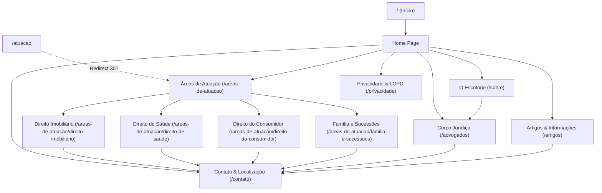

# WDLC 2.2 — Wireframes Estruturais e Taxonomia das Especialidades Jurídicas

> **Status:** Concluído e Homologado  
> **Fase:** 2 — Arquitetura da Informação, Sitemap e Rotas PHP  
> **Sub-issue:** [#6](https://github.com/souza-guedes/site-institucional/issues/6)  
> **Épico Relacionado:** [#4](https://github.com/souza-guedes/site-institucional/issues/4)  
> **JSON Schema da Taxonomia:** [`schemas/sitemap-taxonomy.schema.json`](../../schemas/sitemap-taxonomy.schema.json)  
> **Dataset Canônico de Taxonomia:** [`data/sitemap-taxonomy.json`](../../data/sitemap-taxonomy.json)  
> **Entidades e Validador:** [`src/Domain/Entities/TaxonomyArea.php`](../../src/Domain/Entities/TaxonomyArea.php) e [`src/Domain/Taxonomy/TaxonomyValidator.php`](../../src/Domain/Taxonomy/TaxonomyValidator.php)  
> **Suíte de Testes:** 70 testes unitários determinísticos (`70/70 PASS`) em [`tests/run_tests.php`](../../tests/run_tests.php)  
> **Documento no Notion:** [Souza Guedes Advogados | Wireframes Estruturais e Taxonomia das Especialidades Jurídicas (WDLC 2.2)](https://app.notion.com/p/Souza-Guedes-Advogados-Wireframes-Estruturais-e-Taxonomia-das-Especialidades-Jur-dicas-WDLC-2-2-3f2ea742df3981648651ef9c59b238af)

---

## 1. Visão Geral & Conformidade Ética OAB

A entrega **WDLC 2.2** estabelece a arquitetura de informação, o fluxo de navegação do usuário (*User Flow*), a taxonomia canônica das áreas de atuação do escritório **Souza Guedes Advogados** e os **wireframes estruturais de baixa/média fidelidade priorizando navegação mobile (*mobile-first*)**.

### 1.1. Diretriz de Nomenclatura (Provimento CFOAB nº 205/2021)
O **Art. 3º, III do Provimento CFOAB nº 205/2021** e o **Art. 3º-A do Estatuto da Advocacia** vedam expressamente a autodenominação de "especialista" ou a promessa de "especialidade" sem que haja título formalmente certificado por instituição reconhecida ou notória especialização comprovada.
- Toda a hierarquia de navegação, breadcrumbs, menus e componentes adota a terminologia canônica **"Áreas de Atuação"** ou **"Prática Jurídica"**.
- A rota `/atuacao` foi configurada como **redirecionamento permanente HTTP 301** para a rota canônica `/areas-de-atuacao`.

---

## 2. Mapa Canônico de Rotas e Navegação

Todas as páginas do portal são entregues através de rotas amigáveis (*clean URLs*) sem extensões de script (`.php`):

| Rota Canônica | Controlador | View | Finalidade & Requisitos OAB |
| --- | --- | --- | --- |
| `/` | `HomeController` | `pages/home.php` | Apresentação institucional, áreas de atuação e identificação dos sócios com OAB/SP. |
| `/sobre` | `AboutController` | `pages/about.php` | Trajetória dos sócios, valores éticos, infraestrutura da sede própria na Vila Ema. |
| `/areas-de-atuacao` | `PracticeAreaController` | `pages/practice-areas.php` | Visão geral das 4 disciplinas de prática jurídica e filtros por público (PF/PJ). |
| `/areas-de-atuacao/{slug}` | `PracticeAreaController` | `pages/practice-area-detail.php` | Detalhamento técnico-jurídico por disciplina (usucapião, saúde, consumidor, família). |
| `/atuacao` | *(Router Redirect)* | *Redirect 301* | Encaminhamento permanente para `/areas-de-atuacao`. |
| `/advogados` | `LawyerController` | `pages/lawyers.php` | Corpo jurídico: Rodrigo Guedes da Silva (OAB/SP 538.416) e Lays Regina de Souza (OAB/SP 511.204). |
| `/artigos` | `ArticleController` | `pages/articles.php` | Informações e orientações jurídicas educativas (Art. 4º do Provimento CFOAB 205/2021). |
| `/contato` | `ContactController` | `pages/contact.php` | Canais formais de atendimento passivo, mapa da sede na Vila Ema e formulário com disclaimer. |
| `/privacidade` | `PrivacyController` | `pages/privacy.php` | Política de Privacidade e Governança de Dados (LGPD — Lei 13.709/2018) e canal do DPO. |
| *fallback* | `ErrorController` | `pages/404.php` | Handler customizado para erro 404 (status HTTP 404). |

---

## 3. Fluxo de Navegação do Usuário (User Flow)



---

## 4. Taxonomia Canônica das Áreas de Atuação

O catálogo formal em [`data/sitemap-taxonomy.json`](../../data/sitemap-taxonomy.json) estrutura as 4 disciplinas jurídicas com escopo claro e termos auditados:

### 4.1. Direito Imobiliário (`real-estate-law` / `direito-imobiliario`)
- **Público Atendido:** Pessoas físicas (proprietários, adquirentes, locatários), investidores/arrematantes e pessoas jurídicas (imobiliárias, construtoras).
- **Sub-disciplinas:** Usucapião (judicial e extrajudicial), ações locatícias e despejo, reintegração/manutenção/imissão de posse, arrematação de imóveis em leilão, indenizações por atraso na entrega de obras e regularização fundiária.
- **Ritos Processuais:**
  - *Judicial:* Ação de Usucapião, Despejo, Ações Possessórias/Petitórias, Indenizatória por Atraso de Obra, Embargos à Arrematação.
  - *Extrajudicial:* Usucapião em Cartório de Registro de Imóveis (Art. 216-A da LRP), Notificação Premonitória, Due Diligence Imobiliária e Retificação Registral.
- **Termos Vedados:** *"Imóvel garantido"*, *"Despejo em 24h"*, *"Cancele seu distrato sem custos"*, *"Causa ganha em usucapião"*.
- **Termos Recomendados:** *"Análise de regularidade registral"*, *"Assessoria para arrematação"*, *"Ações possessórias"*, *"Análise de viabilidade jurídica"*.

### 4.2. Direito de Saúde (`health-law` / `direito-de-saude`)
- **Público Atendido:** Pacientes e familiares, beneficiários de planos de saúde, profissionais da saúde e clínicas médicas.
- **Sub-disciplinas:** Liberação de medicamentos de alto custo, negativas de cobertura de cirurgias/exames/procedimentos, restabelecimento de convênios cancelados, reajustes abusivos de mensalidade e responsabilidade civil por erro médico.
- **Ritos Processuais:**
  - *Judicial:* Obrigação de Fazer com Pedido de Tutela de Urgência (liminar), Ação Revisional de Cláusulas Contratuais, Ação Indenizatória por Falha de Prestação.
  - *Extrajudicial:* Requerimento Administrativo perante operadoras/SUS, Reclamações na ANS e composições consensuais.
- **Termos Vedados:** *"Liminar garantida"*, *"Remédio grátis para todos"*, *"Indenização certa por erro médico"*, *"Resultado garantido contra convênio"*.
- **Termos Recomendados:** *"Tutela de urgência para tratamento"*, *"Revisão de reajustes contratuais"*, *"Responsabilidade profissional em saúde"*.

### 4.3. Direito do Consumidor (`consumer-law` / `direito-do-consumidor`)
- **Público Atendido:** Pessoas físicas consumidoras e micro/pequenas empresas nas relações de consumo.
- **Sub-disciplinas:** Negativação indevida e cadastros restritivos (SPC/Serasa), interrupção injustificada de serviços essenciais (água, energia, telefonia), fraudes e falhas em serviços bancários/digitais e vícios de produtos.
- **Ritos Processuais:**
  - *Judicial:* Inexistência de débito com pedido liminar de exclusão de apontamento, Obrigação de fazer para restabelecimento de serviço essencial e Reparação por danos morais e materiais.
  - *Extrajudicial:* Notificação formal perante SAC/Ouvidoria, intermediação no Procon e plataformas públicas de resolução de disputas.
- **Termos Vedados:** *"Limpe seu nome em 24h"*, *"Causa ganha contra banco"*, *"Risco zero"*, *"Indenização milionária garantida"*.
- **Termos Recomendados:** *"Exclusão de apontamento indevido"*, *"Reparação por vícios de produtos"*, *"Serviços essenciais"*, *"Defesa do consumidor em juízo"*.

### 4.4. Direito de Família e Sucessões (`family-successions` / `familia-e-sucessoes`)
- **Público Atendido:** Cônjuges, conviventes, herdeiros, inventariantes e núcleos familiares.
- **Sub-disciplinas:** Divórcio consensual e litigioso, dissolução de união estável, partilha de bens, fixação/revisão de alimentos, guarda e convivência familiar, inventário judicial/extrajudicial e planejamento sucessório.
- **Ritos Processuais:**
  - *Judicial:* Ação de Divórcio e Partilha, Ação de Alimentos e Cumprimento de Sentença, Guarda e Convivência, Inventário e Arrolamento.
  - *Extrajudicial:* Divórcio e Separação em Cartório de Notas, Inventário e Partilha Extrajudicial, Escrituras de União Estável e Mediação Familiar.
- **Termos Vedados:** *"Divórcio relâmpago"*, *"Fique com todos os bens"*, *"Pensão máxima garantida"*, *"Tome a guarda dos filhos"*.
- **Termos Recomendados:** *"Planejamento sucessório"*, *"Inventário extrajudicial"*, *"Mediação e resolução consensual de conflitos"*.

---

## 5. Wireframes Estruturais Mobile-First & Desktop

A estrutura das telas foi arquitetada com prioridade ergonômica para dispositivos móveis (*viewport* 375px–414px) e redimensionamento elegante para telas *desktop* (1024px–1440px).

### 5.1. WF-01: Página Inicial (`/`)
```text
+-------------------------------------------------------------+
| [Logo: Souza Guedes Advogados]               [≡ Menu Mobile]|
+-------------------------------------------------------------+
| HERO SECTION                                               |
| "Atuação Jurídica Estratégica, Técnica e Dedicada"         |
| Apresentação sóbria e informativa da banca na Vila Ema      |
| [ Conhecer Áreas de Atuação ]   [ Canais de Atendimento ]  |
+-------------------------------------------------------------+
| ÁREAS DE ATUAÇÃO (Grid 1 Col Mob / 4 Col Desktop)           |
| [Card: Imobiliário]   - Usucapião, Despejo e Arrematações   |
| [Card: Saúde]         - Coberturas, Medicamentos e Cirurgias|
| [Card: Consumidor]    - Negativações e Serviços Essenciais  |
| [Card: Família]       - Divórcio, Alimentos e Inventários   |
| [ Link: Todas as Áreas de Atuação -> ]                      |
+-------------------------------------------------------------+
| CORPO JURÍDICO EM DESTAQUE                                  |
| - Rodrigo Guedes da Silva (OAB/SP nº 538.416)               |
| - Lays Regina de Souza (OAB/SP nº 511.204)                  |
| [ Conhecer Corpo Jurídico -> ]                              |
+-------------------------------------------------------------+
| ARTIGOS & ORIENTAÇÕES EDUCATIVAS                            |
| Textos didáticos sobre direitos e jurisprudência            |
+-------------------------------------------------------------+
| CANAIS DE ATENDIMENTO PASSIVO                               |
| Rua Uhland, 784, Casa 1, Vila Ema, São Paulo/SP             |
| WhatsApp: (11) 93619-1904 | Horário: 10h às 18h            |
+-------------------------------------------------------------+
| FOOTER INSTITUCIONAL COMPLETO COM DISCLAIMER OAB 205/2021   |
+-------------------------------------------------------------+
```

### 5.2. WF-02: O Escritório (`/sobre`)
```text
+-------------------------------------------------------------+
| [Header & Navbar]                                           |
+-------------------------------------------------------------+
| BREADCRUMB: Início > O Escritório                           |
| TÍTULO: Sobre o Escritório Souza Guedes Advogados           |
+-------------------------------------------------------------+
| 1. Trajetória e Advocacia Artesanal                         |
| 2. Sede Própria na Vila Ema e Atendimento Privativo         |
| 3. Rigor Ético, Sigilo Profissional e Transparência         |
+-------------------------------------------------------------+
| [Footer Completo]                                           |
+-------------------------------------------------------------+
```

### 5.3. WF-03: Áreas de Atuação (`/areas-de-atuacao`)
```text
+-------------------------------------------------------------+
| [Header & Navbar]                                           |
+-------------------------------------------------------------+
| BREADCRUMB: Início > Áreas de Atuação                       |
| TÍTULO: Áreas de Prática Jurídica                           |
+-------------------------------------------------------------+
| FILTROS INFORMATIVOS: [ Todos ] [ Pessoas Físicas ] [ PJs ] |
| LISTA COMPLETA DAS 4 DISCIPLINAS EM CARDS DETALHADOS        |
| - Direito Imobiliário                                       |
| - Direito de Saúde                                          |
| - Direito do Consumidor                                     |
| - Direito de Família e Sucessões                            |
+-------------------------------------------------------------+
| [Footer Completo]                                           |
+-------------------------------------------------------------+
```

### 5.4. WF-04: Detalhe de Área (`/areas-de-atuacao/{slug}`)
```text
+-------------------------------------------------------------+
| [Header & Navbar]                                           |
+-------------------------------------------------------------+
| BREADCRUMB: Início > Áreas de Atuação > {Nome da Área}      |
| TÍTULO: {Nome da Disciplina}                                |
+-------------------------------------------------------------+
| - Foco Principal e Resumo Técnico                           |
| - Escopo de Atuação e Serviços Típicos                      |
| - Ritos Processuais (Judiciais e Extrajudiciais)            |
| - Público Atendido (Perfis PF e PJ)                         |
| - Box de Atendimento Passivo: "Fale com a Banca"            |
+-------------------------------------------------------------+
| [Footer Completo]                                           |
+-------------------------------------------------------------+
```

### 5.5. WF-05: Corpo Jurídico (`/advogados`)
```text
+-------------------------------------------------------------+
| [Header & Navbar]                                           |
+-------------------------------------------------------------+
| BREADCRUMB: Início > Corpo Jurídico                         |
| TÍTULO: Corpo Jurídico & Sócios Fundadores                  |
+-------------------------------------------------------------+
| SÓCIO 1: Rodrigo Guedes da Silva — OAB/SP nº 538.416        |
| - Formação: USJT | Extensão: Falências (ESA/OAB)            |
| - Atuação Principal: Direito Civil e Empresarial            |
+-------------------------------------------------------------+
| SÓCIA 2: Lays Regina de Souza — OAB/SP nº 511.204           |
| - Formação: USJT | Pós-graduação: Imobiliário Notarial (PUC)|
| - Atuação Principal: Direito Civil e Imobiliário            |
+-------------------------------------------------------------+
| AVISO: Qualificações verdadeiras (Art. 1º, § 1º Prov. 205)  |
+-------------------------------------------------------------+
| [Footer Completo]                                           |
+-------------------------------------------------------------+
```

### 5.6. WF-06: Artigos e Informações (`/artigos`)
```text
+-------------------------------------------------------------+
| [Header & Navbar]                                           |
+-------------------------------------------------------------+
| BREADCRUMB: Início > Artigos & Orientações                  |
| TÍTULO: Artigos e Informações Jurídicas                     |
+-------------------------------------------------------------+
| AVISO EM DESTAQUE: Natureza estritamente educativa e       |
| acadêmica (Art. 4º Provimento CFOAB nº 205/2021).           |
+-------------------------------------------------------------+
| GRADE DE ARTIGOS EDUCATIVOS:                                |
| 1. Requisitos do Usucapião Extrajudicial (Imobiliário)      |
| 2. Medicamentos de Alto Custo e Jurisprudência (Saúde)      |
| 3. Negativação Indevida e Direitos do Consumidor            |
+-------------------------------------------------------------+
| [Footer Completo]                                           |
+-------------------------------------------------------------+
```

### 5.7. WF-07: Contato e Localização (`/contato`)
```text
+-------------------------------------------------------------+
| [Header & Navbar]                                           |
+-------------------------------------------------------------+
| BREADCRUMB: Início > Contato                                |
| TÍTULO: Contato & Sede Institucional                        |
+-------------------------------------------------------------+
| BLOCO 1: Sede, Horário (10h-18h), WhatsApp e E-mail         |
| BLOCO 2: Formulário Passivo de Primeiro Contato             |
| - Nome, E-mail, Telefone, Área de Interesse e Mensagem      |
| - Consentimento com Política de Privacidade (LGPD)          |
| - Aviso: "O envio não formaliza relação advogado-cliente"   |
+-------------------------------------------------------------+
| [Footer Completo]                                           |
+-------------------------------------------------------------+
```

### 5.8. WF-08: Privacidade & LGPD (`/privacidade`)
```text
+-------------------------------------------------------------+
| [Header & Navbar]                                           |
+-------------------------------------------------------------+
| BREADCRUMB: Início > Política de Privacidade                |
| TÍTULO: Política de Privacidade e Proteção de Dados         |
+-------------------------------------------------------------+
| 1. Compromisso Institucional com a LGPD (Lei 13.709/2018)   |
| 2. Dados Coletados Estritamente Necessários                 |
| 3. Sigilo Profissional e Inviolabilidade Advocatícia        |
| 4. Direitos dos Titulares de Dados Pessoais                 |
| 5. Canal Direto do Encarregado de Dados (DPO)               |
+-------------------------------------------------------------+
| [Footer Completo]                                           |
+-------------------------------------------------------------+
```

---

## 6. Verificação e Evidências Técnicas

A entrega foi homologada através de **70 testes unitários determinísticos**:
- **Test Runner Local:** `php tests/run_tests.php`
- **Taxa de Sucesso:** `70/70 PASS` (100% verde sem dependências externas).
- **Suítes de Testes Cobertas:**
  - `SitemapTaxonomySchemaTest` (5 testes): validação estrutural do JSON Schema e integridade do dataset.
  - `TaxonomyEntityTest` (3 testes): instanciação e ritos processuais das entidades `TaxonomyArea` e `SitemapRoute`.
  - `TaxonomyComplianceTest` (3 testes): validação ética automatizada de expressões proibidas da OAB.
  - `RouterExpandedTest` (3 testes): rotas `/advogados`, `/artigos`, `/privacidade`, redirect 301 de `/atuacao` e 404 em slug inválido.
  - Testes anteriores preservados sem regressão (56 testes).
